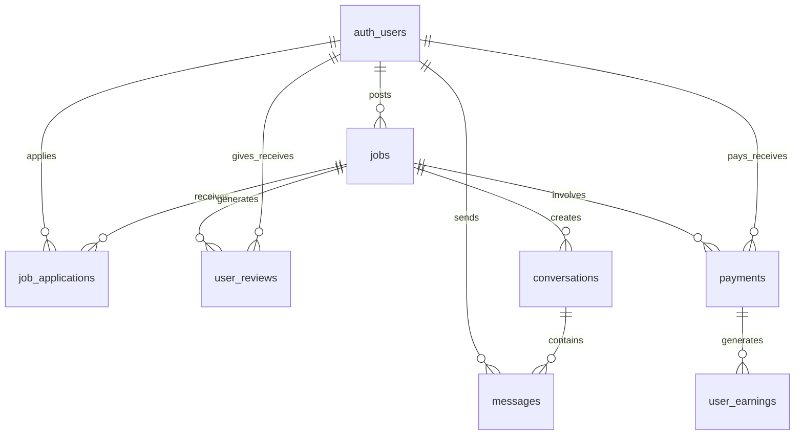

# Design Document

## Overview

This design document outlines the database schema enhancements and system architecture changes needed to transform the Uneven Jobs platform into a complete marketplace with job applications, user reviews, messaging, and payment processing capabilities. The design focuses on migrating from Neon PostgreSQL to Supabase and leveraging Supabase's built-in features including real-time subscriptions, authentication, storage, and Row Level Security while maintaining compatibility with the current Hono.js architecture.

## Architecture

### Database Migration to Supabase

The enhanced system will migrate from Neon to Supabase PostgreSQL and add four main functional areas:

1. **Job Applications System** - Manages the application process between job seekers and posters
2. **Rating & Review System** - Handles user ratings and feedback after job completion
3. **Real-time Messaging System** - Enables instant communication using Supabase real-time subscriptions
4. **Payment Tracking System** - Records all financial transactions and escrow management
5. **File Storage System** - Manages job images and message attachments using Supabase Storage

### System Integration Points

- **Authentication**: Migrate from Auth.js to Supabase Auth for better integration and built-in features
- **Database**: Replace `@neondatabase/serverless` with `@supabase/supabase-js` client
- **Real-time Features**: Use Supabase real-time subscriptions instead of WebSockets
- **Security**: Implement Row Level Security (RLS) policies for data protection
- **API Layer**: Hybrid approach using Supabase auto-generated APIs and custom Hono.js routes
- **Storage**: Supabase Storage buckets for user avatars, job images, and message attachments

## Components and Interfaces

### 1. Job Applications Component

**Supabase Migration:**
- Migrate existing `auth_users` table to Supabase Auth users
- Update foreign key references to use Supabase Auth user IDs

**Database Tables:**
```sql
-- Job applications with bidding capability
CREATE TABLE job_applications (
    id UUID PRIMARY KEY DEFAULT gen_random_uuid(),
    job_id UUID NOT NULL REFERENCES jobs(id) ON DELETE CASCADE,
    applicant_id UUID NOT NULL REFERENCES auth.users(id) ON DELETE CASCADE,
    message TEXT NOT NULL,
    proposed_rate DECIMAL(10,2),
    proposed_rate_type VARCHAR(20) CHECK (proposed_rate_type IN ('hourly', 'fixed', 'per_day', 'per_week')),
    status VARCHAR(20) DEFAULT 'pending' CHECK (status IN ('pending', 'accepted', 'rejected', 'withdrawn')),
    created_at TIMESTAMP WITH TIME ZONE DEFAULT NOW(),
    updated_at TIMESTAMP WITH TIME ZONE DEFAULT NOW(),
    UNIQUE(job_id, applicant_id)
);

-- Update jobs table to track application status
ALTER TABLE jobs ADD COLUMN status VARCHAR(20) DEFAULT 'active' 
    CHECK (status IN ('active', 'assigned', 'completed', 'cancelled'));
ALTER TABLE jobs ADD COLUMN assigned_to UUID REFERENCES auth.users(id);
ALTER TABLE jobs ADD COLUMN completed_at TIMESTAMP WITH TIME ZONE;

-- Row Level Security Policies
ALTER TABLE job_applications ENABLE ROW LEVEL SECURITY;
CREATE POLICY "Users can view their own applications" ON job_applications
    FOR SELECT USING (applicant_id = auth.uid());
CREATE POLICY "Job posters can view applications for their jobs" ON job_applications
    FOR SELECT USING (job_id IN (SELECT id FROM jobs WHERE user_id = auth.uid()));
```

**API Endpoints:**
- `POST /api/jobs/{id}/apply` - Submit job application
- `GET /api/jobs/{id}/applications` - Get applications for a job (job poster only)
- `GET /api/applications` - Get user's applications
- `PUT /api/applications/{id}/status` - Update application status
- Supabase auto-generated REST API for direct client access with RLS

### 2. Rating & Review Component

**Database Tables with Supabase Integration:**
```sql
-- User reviews and ratings
CREATE TABLE user_reviews (
    id UUID PRIMARY KEY DEFAULT gen_random_uuid(),
    job_id UUID NOT NULL REFERENCES jobs(id),
    reviewer_id UUID NOT NULL REFERENCES auth.users(id),
    reviewee_id UUID NOT NULL REFERENCES auth.users(id),
    rating INTEGER NOT NULL CHECK (rating >= 1 AND rating <= 5),
    review_text TEXT,
    review_type VARCHAR(20) NOT NULL CHECK (review_type IN ('job_poster', 'job_worker')),
    created_at TIMESTAMP WITH TIME ZONE DEFAULT NOW(),
    UNIQUE(job_id, reviewer_id, reviewee_id)
);

-- Cached user rating statistics (updated via Supabase functions)
CREATE TABLE user_rating_stats (
    user_id UUID PRIMARY KEY REFERENCES auth.users(id) ON DELETE CASCADE,
    average_rating DECIMAL(3,2),
    total_reviews INTEGER DEFAULT 0,
    rating_as_poster DECIMAL(3,2),
    rating_as_worker DECIMAL(3,2),
    reviews_as_poster INTEGER DEFAULT 0,
    reviews_as_worker INTEGER DEFAULT 0,
    updated_at TIMESTAMP WITH TIME ZONE DEFAULT NOW()
);

-- Row Level Security for reviews
ALTER TABLE user_reviews ENABLE ROW LEVEL SECURITY;
CREATE POLICY "Users can view reviews about them" ON user_reviews
    FOR SELECT USING (reviewee_id = auth.uid());
CREATE POLICY "Users can view reviews they wrote" ON user_reviews
    FOR SELECT USING (reviewer_id = auth.uid());

-- Supabase function to automatically update rating stats
CREATE OR REPLACE FUNCTION update_user_rating_stats()
RETURNS TRIGGER AS $$
BEGIN
    -- Update rating statistics when a new review is added
    INSERT INTO user_rating_stats (user_id, average_rating, total_reviews)
    VALUES (NEW.reviewee_id, NEW.rating, 1)
    ON CONFLICT (user_id) DO UPDATE SET
        average_rating = (
            SELECT AVG(rating)::DECIMAL(3,2) 
            FROM user_reviews 
            WHERE reviewee_id = NEW.reviewee_id
        ),
        total_reviews = (
            SELECT COUNT(*) 
            FROM user_reviews 
            WHERE reviewee_id = NEW.reviewee_id
        ),
        updated_at = NOW();
    RETURN NEW;
END;
$$ LANGUAGE plpgsql;

CREATE TRIGGER update_rating_stats_trigger
    AFTER INSERT ON user_reviews
    FOR EACH ROW EXECUTE FUNCTION update_user_rating_stats();
```

**API Endpoints:**
- `POST /api/jobs/{id}/review` - Submit review after job completion
- `GET /api/users/{id}/reviews` - Get user's reviews and ratings
- `GET /api/users/{id}/rating-stats` - Get user's rating statistics
- Supabase auto-generated APIs with RLS for secure access

### 3. Real-time Messaging Component

**Database Tables with Supabase Real-time:**
```sql
-- Conversation threads between users
CREATE TABLE conversations (
    id UUID PRIMARY KEY DEFAULT gen_random_uuid(),
    job_id UUID NOT NULL REFERENCES jobs(id),
    participant_1 UUID NOT NULL REFERENCES auth.users(id),
    participant_2 UUID NOT NULL REFERENCES auth.users(id),
    status VARCHAR(20) DEFAULT 'active' CHECK (status IN ('active', 'archived')),
    last_message_at TIMESTAMP WITH TIME ZONE DEFAULT NOW(),
    created_at TIMESTAMP WITH TIME ZONE DEFAULT NOW(),
    updated_at TIMESTAMP WITH TIME ZONE DEFAULT NOW(),
    UNIQUE(job_id, participant_1, participant_2)
);

-- Individual messages within conversations (real-time enabled)
CREATE TABLE messages (
    id UUID PRIMARY KEY DEFAULT gen_random_uuid(),
    conversation_id UUID NOT NULL REFERENCES conversations(id) ON DELETE CASCADE,
    sender_id UUID NOT NULL REFERENCES auth.users(id),
    message_text TEXT,
    message_type VARCHAR(20) DEFAULT 'text' CHECK (message_type IN ('text', 'system', 'image', 'file')),
    file_url TEXT, -- Supabase Storage URL for attachments
    read_at TIMESTAMP WITH TIME ZONE,
    created_at TIMESTAMP WITH TIME ZONE DEFAULT NOW()
);

-- Enable real-time for messages table
ALTER PUBLICATION supabase_realtime ADD TABLE messages;
ALTER PUBLICATION supabase_realtime ADD TABLE conversations;

-- Row Level Security for messaging
ALTER TABLE conversations ENABLE ROW LEVEL SECURITY;
ALTER TABLE messages ENABLE ROW LEVEL SECURITY;

CREATE POLICY "Users can view their conversations" ON conversations
    FOR SELECT USING (participant_1 = auth.uid() OR participant_2 = auth.uid());

CREATE POLICY "Users can view messages in their conversations" ON messages
    FOR SELECT USING (
        conversation_id IN (
            SELECT id FROM conversations 
            WHERE participant_1 = auth.uid() OR participant_2 = auth.uid()
        )
    );
```

**Real-time Features:**
- Supabase real-time subscriptions for instant message delivery
- Typing indicators using Supabase presence
- Online/offline status tracking
- Message read receipts with real-time updates

**API Endpoints:**
- `GET /api/conversations` - Get user's conversations
- `GET /api/conversations/{id}/messages` - Get messages in a conversation
- `POST /api/conversations/{id}/messages` - Send a message
- `PUT /api/messages/{id}/read` - Mark message as read
- Supabase real-time subscriptions for live updates

### 4. Payment Tracking Component

**Database Tables with Supabase Integration:**
```sql
-- Payment transactions and escrow management
CREATE TABLE payments (
    id UUID PRIMARY KEY DEFAULT gen_random_uuid(),
    job_id UUID NOT NULL REFERENCES jobs(id),
    payer_id UUID NOT NULL REFERENCES auth.users(id),
    payee_id UUID NOT NULL REFERENCES auth.users(id),
    amount DECIMAL(10,2) NOT NULL,
    currency VARCHAR(3) DEFAULT 'USD',
    status VARCHAR(20) DEFAULT 'pending' CHECK (status IN ('pending', 'escrowed', 'released', 'refunded', 'failed')),
    stripe_payment_intent_id VARCHAR(255),
    stripe_transfer_id VARCHAR(255),
    escrow_created_at TIMESTAMP WITH TIME ZONE,
    released_at TIMESTAMP WITH TIME ZONE,
    created_at TIMESTAMP WITH TIME ZONE DEFAULT NOW(),
    updated_at TIMESTAMP WITH TIME ZONE DEFAULT NOW()
);

-- Payment method storage (tokenized)
CREATE TABLE user_payment_methods (
    id UUID PRIMARY KEY DEFAULT gen_random_uuid(),
    user_id UUID NOT NULL REFERENCES auth.users(id) ON DELETE CASCADE,
    stripe_payment_method_id VARCHAR(255) NOT NULL,
    type VARCHAR(20) NOT NULL,
    last_four VARCHAR(4),
    brand VARCHAR(20),
    is_default BOOLEAN DEFAULT FALSE,
    created_at TIMESTAMP WITH TIME ZONE DEFAULT NOW()
);

-- Earnings tracking for workers
CREATE TABLE user_earnings (
    id UUID PRIMARY KEY DEFAULT gen_random_uuid(),
    user_id UUID NOT NULL REFERENCES auth.users(id) ON DELETE CASCADE,
    payment_id UUID NOT NULL REFERENCES payments(id),
    amount DECIMAL(10,2) NOT NULL,
    platform_fee DECIMAL(10,2) DEFAULT 0,
    net_amount DECIMAL(10,2) NOT NULL,
    tax_year INTEGER,
    created_at TIMESTAMP WITH TIME ZONE DEFAULT NOW()
);

-- Row Level Security for payments
ALTER TABLE payments ENABLE ROW LEVEL SECURITY;
CREATE POLICY "Users can view their payments" ON payments
    FOR SELECT USING (payer_id = auth.uid() OR payee_id = auth.uid());

ALTER TABLE user_earnings ENABLE ROW LEVEL SECURITY;
CREATE POLICY "Users can view their earnings" ON user_earnings
    FOR SELECT USING (user_id = auth.uid());
```

**Supabase Edge Functions for Payment Processing:**
- Stripe webhook handler as Supabase Edge Function
- Payment processing logic with automatic database updates
- Secure payment method tokenization

**API Endpoints:**
- `POST /api/payments/create-escrow` - Create payment escrow for accepted job
- `POST /api/payments/{id}/release` - Release payment after job completion
- `GET /api/payments/history` - Get user's payment history
- `GET /api/earnings` - Get worker's earnings summary
- Supabase Edge Functions for Stripe webhooks

## Data Models

### Core Entity Relationships



### Key Data Constraints

1. **Application Uniqueness**: One application per user per job
2. **Review Constraints**: Reviews only after job completion, one per job per user pair
3. **Payment Integrity**: Payments must reference valid jobs and users
4. **Message Ordering**: Messages maintain chronological order within conversations
5. **Rating Bounds**: All ratings must be between 1-5 stars

## Error Handling

### Database-Level Error Handling

1. **Constraint Violations**: Foreign key and check constraints prevent invalid data
2. **Duplicate Prevention**: Unique constraints on critical relationships
3. **Cascade Deletes**: Proper cleanup when users or jobs are deleted
4. **Transaction Integrity**: All multi-table operations wrapped in transactions

### Application-Level Error Handling

1. **Authentication Errors**: Verify user permissions for all operations
2. **Business Logic Errors**: Validate application states and transitions
3. **Payment Errors**: Handle Stripe API failures and retry logic
4. **Concurrency Errors**: Handle race conditions in job assignments

## Testing Strategy

### Database Testing

1. **Schema Validation**: Test all table constraints and relationships
2. **Data Integrity**: Verify foreign key relationships and cascades
3. **Performance Testing**: Index optimization for common queries
4. **Migration Testing**: Ensure smooth schema updates

### API Testing

1. **Unit Tests**: Individual endpoint functionality
2. **Integration Tests**: End-to-end user workflows
3. **Authentication Tests**: Permission and security validation
4. **Payment Tests**: Stripe integration and error scenarios

### User Acceptance Testing

1. **Job Application Flow**: Complete application and acceptance process
2. **Messaging System**: Real-time communication testing
3. **Review System**: Rating and feedback workflows
4. **Payment Processing**: End-to-end payment scenarios

## Security Considerations

### Data Protection

1. **PII Encryption**: Sensitive user data encrypted at rest
2. **Payment Security**: PCI compliance through Stripe tokenization
3. **Message Privacy**: Conversations only accessible to participants
4. **Access Control**: Role-based permissions for all operations

### API Security

1. **Authentication**: JWT token validation on all protected endpoints
2. **Authorization**: User permission checks for resource access
3. **Rate Limiting**: Prevent abuse of messaging and application endpoints
4. **Input Validation**: Sanitize all user inputs to prevent injection attacks

## Performance Optimization

### Database Optimization

1. **Indexing Strategy**: Indexes on frequently queried columns
2. **Query Optimization**: Efficient joins and pagination
3. **Connection Pooling**: Neon connection pool management
4. **Caching**: Redis caching for user ratings and statistics

### Real-time Features

1. **WebSocket Connections**: Efficient message delivery
2. **Notification System**: Push notifications for mobile apps
3. **Background Jobs**: Async processing for payments and emails
4. **CDN Integration**: Static asset delivery optimization
### 5. Fil
e Storage Component

**Supabase Storage Integration:**
```sql
-- File attachments for jobs and messages
CREATE TABLE file_attachments (
    id UUID PRIMARY KEY DEFAULT gen_random_uuid(),
    user_id UUID NOT NULL REFERENCES auth.users(id),
    job_id UUID REFERENCES jobs(id),
    message_id UUID REFERENCES messages(id),
    file_name TEXT NOT NULL,
    file_size INTEGER NOT NULL,
    file_type VARCHAR(100) NOT NULL,
    storage_path TEXT NOT NULL, -- Supabase Storage path
    public_url TEXT, -- Public URL if file is public
    created_at TIMESTAMP WITH TIME ZONE DEFAULT NOW()
);

-- Row Level Security for file attachments
ALTER TABLE file_attachments ENABLE ROW LEVEL SECURITY;
CREATE POLICY "Users can view their files" ON file_attachments
    FOR SELECT USING (user_id = auth.uid());
```

**Supabase Storage Buckets:**
- `job-images` - Public bucket for job photos
- `user-avatars` - Public bucket for profile pictures
- `message-attachments` - Private bucket for message files
- `documents` - Private bucket for job-related documents

**Storage Policies:**
```sql
-- Allow users to upload their own files
CREATE POLICY "Users can upload files" ON storage.objects
    FOR INSERT WITH CHECK (auth.uid()::text = (storage.foldername(name))[1]);

-- Allow users to view their own files
CREATE POLICY "Users can view own files" ON storage.objects
    FOR SELECT USING (auth.uid()::text = (storage.foldername(name))[1]);
```

## Migration Strategy from Neon to Supabase

### Phase 1: Database Migration
1. **Export existing data** from Neon PostgreSQL
2. **Create Supabase project** and configure database
3. **Migrate schema** with Supabase-specific enhancements
4. **Import data** with proper user ID mapping
5. **Set up Row Level Security** policies

### Phase 2: Authentication Migration
1. **Export user data** from current Auth.js setup
2. **Migrate to Supabase Auth** with proper user mapping
3. **Update client-side authentication** to use Supabase Auth
4. **Test authentication flows** and session management

### Phase 3: Real-time Features
1. **Replace WebSocket implementation** with Supabase real-time
2. **Set up real-time subscriptions** for messaging
3. **Implement presence features** for online status
4. **Add typing indicators** and live updates

### Phase 4: Storage Integration
1. **Set up Supabase Storage buckets** with proper policies
2. **Migrate existing files** to Supabase Storage
3. **Update file upload/download** logic
4. **Implement secure file sharing** in messages